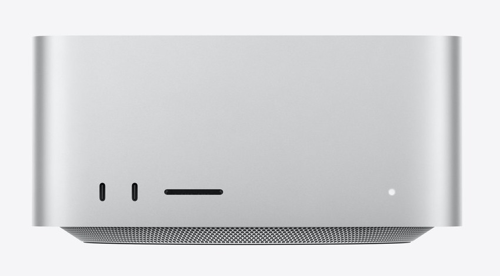

# AI PC 調査プロジェクト

実行環境PCの実力測定と、少し規模の大きいローカルLLMが動作するPCの国内価格比較

> 📅 作成: 2026-08-24 / 更新: 2026-09-23

[^^](../)

## 目次

1. [このプロジェクトについて](#1-このプロジェクトについて)
2. [調査ドキュメント](#2-調査ドキュメント)
3. [調査結果の要点](#3-調査結果の要点)

## 1. このプロジェクトについて

ローカルでAIモデルを動かすためのマシン選定を目的とした調査プロジェクトです。2つの問いを扱っています。

- **いま使っているPCで何ができるのか** — 実行環境の実測スペックと、ローカルLLM用途での限界
- **買うとしたら何がいくらなのか** — 少し規模の大きいローカルLLMが動作するPCの国内価格比較

### 調査に使った手段

| 対象 | 手段 |
|---|---|
| 環境PC のスペック | PowerShell（`Get-CimInstance`・`nvidia-smi`・`Get-NetAdapter`） |
| 各社の価格・仕様 | WebFetch → claude-in-chrome → PlayWright（共有環境）の順に切り替え |
| 製品画像の取得 | PlayWright ヘッドレスChromium。公式・正規流通ドメインに限定して9件取得 |
| HP の価格・確定仕様 | 日本HP のキャンペーンページと公式スペック表（jp.ext.hp.com） |
| Apple Mac の構成・価格 | Apple公式ストアで PlayWright により実際に構成を選択して取得（2026-08-25） |

### このリポジトリの決めごと

[📄 ローカルルール](notes/90_rules/local-rule.md)

📅 作成: 2026-09-05 / 更新: 2026-09-05

## 2. 調査ドキュメント

### ローカルLLM 機種比較 2026

[📄 ローカルLLM 機種比較 2026](notes/01_research/r260916-01-ローカルLLM機種比較.md)

📅 作成: 2026-09-16 / 更新: 2026-09-23

**いま購入できる構成だけ**を対象に、統合メモリ **64GB / 128GB / 256GB** × ストレージ **2TB / 4TB / 8TB** で全機種を並べた統合版。GB10 搭載機 7 機種と Apple 4 機種を OS・在庫つきで比較し、Qwen・Gemma・GLM・Kimi がどこまで動くかを判定しています。手元の環境PCとの距離、統合メモリを持たない選択肢、これから出る機種も収録しました。

### 実行環境PC スペック調査

[📄 実行環境PC スペック調査](notes/01_research/env-pc-spec.md)

📅 作成: 2026-08-24 / 更新: 2026-09-23

Claude Code が動作しているホストマシン（HP Pavilion Gaming Laptop 15-dk2xxx）の実測スペックと、AI用途での評価。CPU・GPU・メモリ・ストレージ・ネットワークの構成情報と、AI専用機との定量比較を収録しています。

## 3. 調査結果の要点

### 環境PC の限界は VRAM 4 GB

| 比較軸 | 環境PC | HP ZGX Nano G1n | 差（環境PC比） | Mac Studio M5 Ultra 256GB | 差（環境PC比） |
|---|---|---|---|---|---|
| 外観 |  |  | — |  | — |
| AIに使えるメモリ | 4 GB（VRAM） | 128 GB（統合） | 32倍 | 256 GB（統合） | 64倍 |
| メモリ帯域 | 約 51.2 GB/s | 273 GB/s | 約 5.3倍 | 1.2 TB/s | 約 23.4倍 |
| CPUコア数 | 4コア8スレッド | Arm 20コア | 5倍 | 36コア | 9倍 |
| 扱えるモデル規模 | 2B級以下（量子化なし） 7B級（4bit） | 55B級（量子化なし） 125B級（4bit） 355B級（2bit） | 約 18倍（4bit比） | 117B級（量子化なし） 355B級（4bit） 744B級（2bit） | 約 51倍（4bit比） |
| ストレージ | 1 TB | 4 TB | 4倍 | 4 TB | 4倍 |
| 価格 | 約20万円 | 1,098,900 円（税込） | 約 5.5倍 | 2,173,800 円（税込） | 約 10.9倍 |

開発機としては十分に実用的ですが、中〜大規模モデルのローカル実行は VRAM 4 GB が絶対的な壁になります。CPU は BGA 実装、メモリは2スロットとも占有済みで、アップグレードでこの壁は越えられません。

### GB10機は性能が全機種同一、差は保証と価格だけ

| 順位 | 製品 | 価格（税込・4TB構成） | 保証 |
|---:|---|---:|---|
| 1 | **HP ZGX Nano G1n** | **1,098,900 円** 定価 2,125,200 円 | ✅ **メーカー直販** 1年センドバック |
| 2 | MSI EdgeXpert | 1,110,659 円 | ⚠ **要確認** 出品者・保証条件は個別確認 |
| 3 | GIGABYTE AI TOP ATOM | 1,366,800 円 | 販売店依存 |
| 4 | Acer Veriton GN100 | 1,386,000 円 通常 1,999,800 円 | 公式直販 |
| 5 | NVIDIA DGX Spark | 1,821,521 円 | ⚠ **要確認** 直前まで最安だった出品が消えた |
| 6 | Dell Pro Max with GB10 | 2,140,820 円 配送料込 | ✅ **オンサイト可** |
| 7 | Lenovo ThinkStation PGX | 2,176,790 円 | ❌ **正規流通は在庫なし** |

7機種すべてが NVIDIA のリファレンス設計で、SoC・メモリ128GB・帯域273GB/s・本体サイズまで一致します。最安と最高値の差 約108万円は、すべて保証内容と流通経路の差です。

### Apple Mac は「容量か帯域か」の選択になる

| 機種 | メモリ | メモリ帯域 | ストレージ | 価格（税込） |
|---|---:|---:|---|---:|
| **HP ZGX Nano G1n** | 128GB | 273 GB/s | 4TB | 1,098,900 円 |
| Mac mini M5 Pro | 64GB | 307 GB/s | 4TB | 839,800 円 |
| Mac Studio M5 Max | 128GB | 614 GB/s | 4TB | 1,211,800 円 |
| MacBook Pro 16" M5 Max | 128GB | 614 GB/s | 4TB | 1,389,800 円 |
| Mac Studio M5 Ultra | 256GB | 1.2 TB/s | 4TB | 2,173,800 円 |

Mac はメモリを CPU/GPU 構成ごとに固定で選ぶ方式です。**据置型の Mac Studio も、現行の M5 Ultra を選べば 256GB まで対応します**（前世代までの「96GB が上限」という制約はなくなりました）。128GB であれば GB10 搭載機と Mac Studio M5 Max・MacBook Pro M5 Max が同容量で並びますが、メモリ帯域は Mac 側が 2.25倍速く、LLM の推論速度に効きます。

> [!IMPORTANT]
> <strong>分かれ道は「128GB で足りるか、256GB が要るか」です。</strong>128GB で足りるなら、GB10 搭載機（CUDA 資産をそのまま使える）と Mac Studio M5 Max・MacBook Pro M5 Max（同容量で 2.25倍速い）のどちらを取るかの選択になります。256GB が要るなら、据置型でその容量に届く機種は Mac Studio M5 Ultra だけです。CUDA 資産がある場合は、いずれの Mac を選んでも macOS への移植コストが上乗せされます。

いずれも Web 掲載価格での比較です。法人向けの構成では個別見積で下がる余地があるため、実際の調達額はこの表より低くなり得ます。

> [!WARNING]
> <strong>HP の価格は市況で変動します。</strong>GB10 搭載機の通販価格は数日単位で入れ替わるため、最安が定価 2,125,200 円に戻れば、2位以下の MSI（1,110,659円）や GIGABYTE（1,366,800円）が最安になり得ます。

[^^](../)
