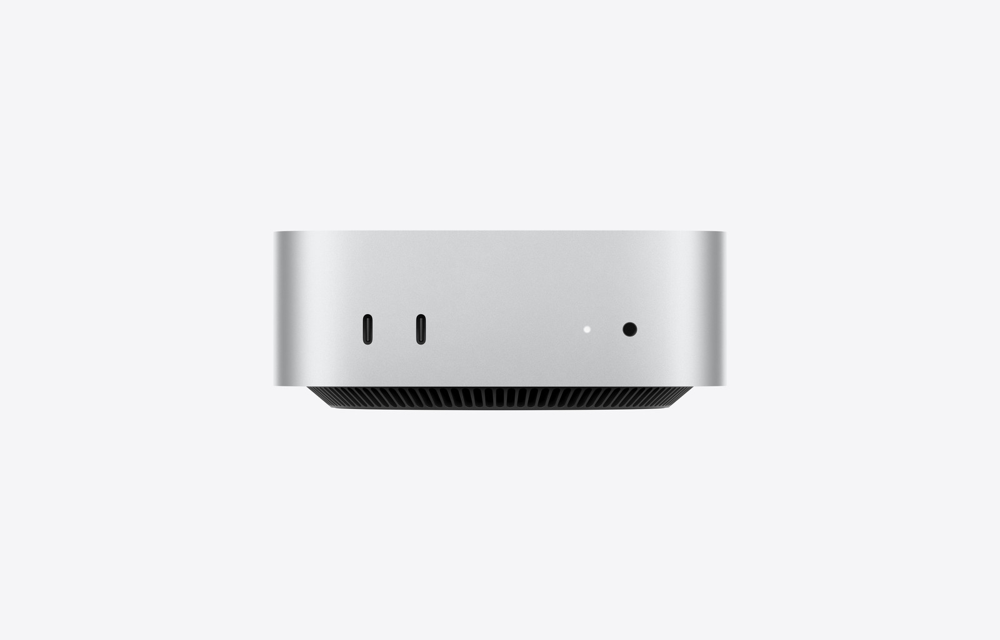

# 新Mac mini / Mac Studio 2026 調査

予約受付が始まった M6・M5 Pro・M5 Max・M5 Ultra 搭載機を、Apple 公式ストアの構成別価格で比較

> 📅 作成: 2026-08-26 / 更新: 2026-09-19

« [README に戻る](../../README.md)

> [!IMPORTANT]
> <strong>この資料は 2026-09-05 時点の情報です。</strong>価格・在庫・キャンペーンはその後変わっています。最新の比較は [ローカルLLM 機種比較 2026](r260916-01-ローカルLLM機種比較.md) を参照してください。

## 目次

1. [調査の対象と前回からの変化](#1-調査の対象と前回からの変化)
2. [Mac mini（M6 / M5 Pro）](#2-mac-minim6--m5-pro)
3. [Mac Studio（M5 Max / M5 Ultra）](#3-mac-studiom5-max--m5-ultra)
4. [HP ZGX Nano G1n との比較](#4-hp-zgx-nano-g1n-との比較)
5. [判断材料](#5-判断材料)

## 1. 調査の対象と前回からの変化

Apple 公式ストアで **Mac mini と Mac Studio の新モデルが予約受付を開始**していました。価格はすべて、購入画面で実際に構成を選択して取得した金額です（カタログの「〜円から」ではありません）。

| 製品 | 搭載チップ | 発売 |
|---|---|---|
| Mac mini | M6 / M5 Pro | 2026年9月22日 |
| Mac Studio | M5 Max / M5 Ultra | 予約受付中 |

### 前回調査の結論が覆りました

本プロジェクトの別レポートで「**Mac Studio は 96GB が上限**」「据置型で 128GB を積めるのは GB10 搭載機だけ」と結論していましたが、新モデルで前提が変わりました。

| 項目 | 前回調査（M4 Max / M3 Ultra） | 今回（M5 Max / M5 Ultra） |
|---|---|---|
| Mac Studio 最大メモリ | 96GB | **256GB**（実際に選択できる範囲） |
| 最大メモリ帯域 | 819 GB/s（M3 Ultra） | **1.2 TB/s**（M5 Ultra） |
| 128GB構成 | 存在しない | ✅ **追加** M5 Max で選べる |
| Mac mini 最大メモリ | 48GB（M4 Pro） | 64GB（M5 Pro） |
| 96GB / 4TB の価格 | 1,169,800 円 | 1,219,800 円 +50,000円で帯域1.47倍 |

> [!IMPORTANT]
> **仕様ページには 512GB の記載がありますが、購入画面では選べません。** 技術仕様には「512GBユニファイドメモリ（36コアCPUと80コアGPU搭載M5 Ultra）」とありますが、予約時点のメモリ選択肢は 96GB と 256GB の2つだけでした。512GB構成は現時点では注文できません。

## 2. Mac mini（M6 / M5 Pro）

12.7cm四方の筐体はそのままで、ポートが前面・背面に配置されています。2.5Gb Ethernet、Wi-Fi 7、Bluetooth 6 に対応。**複数台をクラスタリングして、より大規模なローカルAIモデルを実行できる**と Apple 自身が明記しています。

### チップの仕様

| 項目 | M6 | M5 Pro |
|---|---|---|
| CPU | 12コア | 最大18コア |
| GPU | 12コア | 最大20コア |
| Neural Engine | デュアル16コア | 16コア |
| メモリ帯域 | 最大 170 GB/s | **307 GB/s** |
| 選べるメモリ | 16 / 24 / 32GB | 24 / 48 / **64GB** |
| ストレージ | 256GB〜2TB | 512GB〜8TB |
| Thunderbolt | 4（×3） | 5（×3・最大120Gb/s） |

### 構成別価格

| 構成 | メモリ | 帯域 | ストレージ | 価格 |
|---|---:|---:|---|---:|
| M6 12コアCPU/12コアGPU | 16GB | 170 GB/s | 256GB | 149,800 円 |
| M6 12コアCPU/12コアGPU | 32GB | 170 GB/s | 1TB | 311,800 円 |
| M6 12コアCPU/12コアGPU | 32GB | 170 GB/s | 2TB | 401,800 円 |
| M5 Pro 15コアCPU/16コアGPU | 24GB | 307 GB/s | 512GB | 299,800 円 |
| M5 Pro 15コアCPU/16コアGPU | 64GB | 307 GB/s | 1TB | 533,800 円 |
| M5 Pro 18コアCPU/20コアGPU | 64GB | 307 GB/s | 1TB | 569,800 円 |
| M5 Pro 18コアCPU/20コアGPU | 64GB | 307 GB/s | 4TB | **839,800 円** |

### 公開されているLLM性能の指標

Apple は LM Studio での「最初のトークン生成までの時間」を比較指標として公開しています。いずれも M1 搭載 Mac mini を基準とした倍率です。

| 搭載チップ | M1比の倍率 |
|---|---:|
| M5 Pro | **22.3倍** |
| M6 | 13.5倍 |
| M4 Pro | 5.6倍 |
| M4 | 2.8倍 |
| M2 Pro | 2.6倍 |

> [!IMPORTANT]
> **これはプロンプト処理（最初のトークンまでの時間）の指標で、トークン生成速度そのものではありません。** 生成速度はメモリ帯域に律速されるため、M6 の 170GB/s と M5 Pro の 307GB/s の差がそのまま効きます。M6 が M4 Pro より上の倍率を示していても、帯域では M5 Pro が 1.8倍あります。

## 3. Mac Studio（M5 Max / M5 Ultra）

筐体サイズは 19.7 × 19.7 × 9.5cm で従来と同じです。Thunderbolt 5 ×4、10Gb Ethernet、Wi-Fi 7、Bluetooth 6、Apple N1 ワイヤレスチップを搭載。最大消費電力は 480W です。

### チップの仕様

| 項目 | M5 Max | M5 Ultra |
|---|---|---|
| CPU | 18コア （6スーパーコア + 12高性能コア） | 30〜36コア （10スーパーコア + 20高性能コア） |
| GPU | 32 または 40コア | 64 または 80コア |
| Neural Engine | 16コア | 32コア |
| メモリ帯域 | 460 GB/s（32コアGPU） **614 GB/s**（40コアGPU） | **1.2 TB/s** |
| 選べるメモリ | 36GB（32コアGPU） 48 / 64 / **128GB**（40コアGPU） | 96GB（64コアGPU） **256GB**（80コアGPU） |
| ストレージ | 512GB〜8TB | 1TB〜16TB |
| 重量 | 2.7 kg | 3.6 kg |

メモリ容量は前世代と同様に **CPU/GPUコア構成に固定**されています。128GB を選ぶには 40コアGPU の M5 Max、256GB を選ぶには 80コアGPU の M5 Ultra が必要です。

### 構成別価格

| 構成 | メモリ | 帯域 | ストレージ | 価格 |
|---|---:|---:|---|---:|
| M5 Max 18コアCPU/32コアGPU | 36GB | 460 GB/s | 512GB | 419,800 円 |
| M5 Max 18コアCPU/40コアGPU | 128GB | 614 GB/s | 1TB | 941,800 円 |
| M5 Max 18コアCPU/40コアGPU | 128GB | 614 GB/s | 4TB | **1,211,800 円** |
| M5 Ultra 30コアCPU/64コアGPU | 96GB | 1.2 TB/s | 1TB | 949,800 円 |
| M5 Ultra 30コアCPU/64コアGPU | 96GB | 1.2 TB/s | 4TB | 1,219,800 円 |
| M5 Ultra 36コアCPU/80コアGPU | 256GB | 1.2 TB/s | 1TB | 1,903,800 円 |
| M5 Ultra 36コアCPU/80コアGPU | 256GB | 1.2 TB/s | 4TB | 2,173,800 円 |

## 4. HP ZGX Nano G1n との比較

本プロジェクトの別レポートで比較した <strong>HP ZGX Nano G1n（GB10 / 128GB / 4TB / キャンペーン価格 税込 998,800円 / 帯域 273GB/s）</strong>を基準に、新Macを並べます。

| 比較条件 | 機種 | メモリ / 帯域 | 価格 | HPとの差 |
|---|---|---|---:|---:|
| 基準 | HP ZGX Nano G1n | 128GB / 273 GB/s | 998,800 円 | — |
| **同容量128GB** | Mac Studio M5 Max | 128GB / **614 GB/s** | 1,211,800 円 | +213,000 円 帯域2.25倍 |
| 帯域最優先 | Mac Studio M5 Ultra | 96GB / **1.2 TB/s** | 1,219,800 円 | +221,000 円 帯域4.4倍・容量は−32GB |
| 容量最優先 | Mac Studio M5 Ultra | **256GB** / 1.2 TB/s | 2,173,800 円 | +1,175,000 円 容量2倍・帯域4.4倍 |
| **価格優先** | Mac mini M5 Pro | 64GB / 307 GB/s | **839,800 円** | **−159,000 円** 容量は半分・帯域1.12倍 |

いずれもストレージ 4TB で揃えた比較です。同容量128GBでは Mac 側が21万円高くなり、その差が帯域 2.25倍の対価にあたります。

> [!TIP]
> **Mac mini M5 Pro の 64GB 構成は、GB10 搭載機より 16万円安くなります。** 容量は半分の 64GB ですが帯域は 307GB/s で GB10 を上回ります。扱うモデルが 64GB に収まるなら、価格と速度の両方で優位に立つ構成です。

## 5. 判断材料

### 実測を基準にした速度の見当

前世代の **M4 Max・128GB で 200B 級 MoE（3bit・約 90GB）が 9〜10 tok/s** という実測が公開されています（J-Tech Japan・2026-08-28）。デコード速度は帯域に律速されるため、この実測を基準に新モデルの見当が付きます。

| 機種 | メモリ帯域 | M4 Max 比 | 90GB モデルでの速度 |
|---|---:|---:|---|
| MacBook Pro M4 Max 128GB（前世代） | 546 GB/s | 基準 | **9〜10 tok/s**（実測） |
| Mac mini M6 | 170 GB/s | 0.31倍 | — 32GB上限で載らない |
| Mac mini M5 Pro | 307 GB/s | 0.56倍 | — 64GB上限で載らない |
| Mac Studio M5 Max 128GB | 614 GB/s | 1.12倍 | 約 10〜11 tok/s（推定） |
| Mac Studio M5 Ultra 96GB | 1.2 TB/s | 2.20倍 | 約 20 tok/s 相当だが余裕がない |
| Mac Studio M5 Ultra 256GB | 1.2 TB/s | 2.20倍 | 約 20 tok/s（推定） |
| HP ZGX Nano G1n（GB10） | 273 GB/s | 0.50倍 | 約 4.5〜5 tok/s（推定） |

> [!IMPORTANT]
> **Mac mini は帯域ではなく容量で外れます。** M5 Pro の 307 GB/s は GB10 を上回りますが、64GB 上限のため 90GB のモデルが載りません。M5 Ultra の 96GB 構成も、KV キャッシュ（64k で 2.3 GiB）を足すと余裕がほとんど残らないため、この規模を狙うなら 128GB 以上が実質的な条件になります。

### 扱うモデルサイズから逆算する

4bit量子化でのモデルサイズを基準に、必要なメモリ容量から候補を絞ります。KVキャッシュの余裕として数GBを別に見てください。

| 動かしたいモデル | 必要メモリの目安 | 推奨構成 | 価格 |
|---|---:|---|---:|
| 7〜14B | 5〜9 GB | Mac mini M6 / 16GB | 149,800 円 |
| 32B | 約 19 GB | Mac mini M6 / 32GB | 311,800 円 |
| 70B | 約 40 GB | Mac mini M5 Pro / 64GB | 569,800 円〜 |
| 120B級 | 約 70 GB | Mac Studio M5 Max / 128GB | 941,800 円〜 |
| 200B超 | 120 GB 以上 | Mac Studio M5 Ultra / 256GB または HP ZGX Nano G1n | 1,903,800 円〜 （HPは 998,800 円） |

### Mac と GB10 搭載機の使い分け

| 観点 | 新Mac が有利 | HP ZGX Nano G1n が有利 |
|---|---|---|
| メモリ帯域 | ✅ **307GB/s〜1.2TB/s** 全構成で GB10 の 273GB/s を上回る | — |
| 最大容量 | ✅ **256GB** GB10 の2倍。ただし217万円 | 128GB を **99.9万円**で。容量あたりの単価は最安 |
| エコシステム | macOS + Metal / MLX。汎用PCとして日常利用も兼ねられる | ✅ **CUDA** DGX OS 7。既存のCUDA資産がそのまま動く |
| クラスタ構成 | 複数台のクラスタリングに対応（exo・LM Studio Bionic） | ✅ **ConnectX-7 200GbE** で2台直結 |
| 消費電力 | Mac mini は小型・低消費。Mac Studio は最大480W | ✅ **240W** TypeCアダプター（89%変換効率） |
| 価格 | 64GB 構成なら GB10 より16万円安い。128GB 以上では GB10 が下回る | 128GB という容量では最も安い |

> [!IMPORTANT]
> **新Macの登場で「容量はGB10、帯域はMac」という前回の整理が崩れました。** M5 Ultra は容量でも帯域でも GB10 を上回り、代わりに価格差が100万円以上に開きます。逆に Mac mini M5 Pro は容量が半分でも価格と帯域で優位です。容量・帯域・価格の3軸が絡むため、動かすモデルのサイズを先に決めないと選べません。

### 参照元

- Apple 公式（`apple.com/jp/mac-mini/`・`apple.com/jp/mac-studio/specs/`）— チップ仕様・メモリ帯域・構成上限・LM Studio 性能指標
- Apple 公式ストア（`apple.com/jp/shop/buy-mac/`）— 通常価格。構成を実際に選択して取得
- 取得日: 2026-08-26 / Mac mini 発売日: 2026-09-22

関連レポート: [GB10搭載AIワークステーション 価格比較調査](gb10-ai-workstation-comparison.md)、[実行環境PC スペック調査](env-pc-spec.md)、[HP BIGサマーセール第2弾 LLM用途評価](hp-summersale-llm-pc.md)

« [README に戻る](../../README.md)
