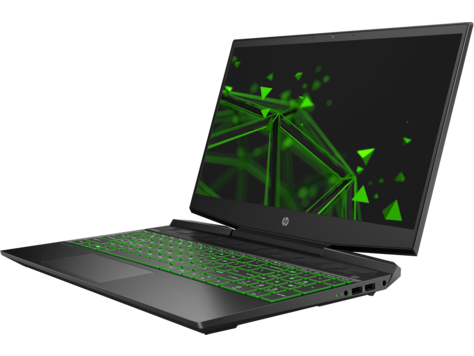
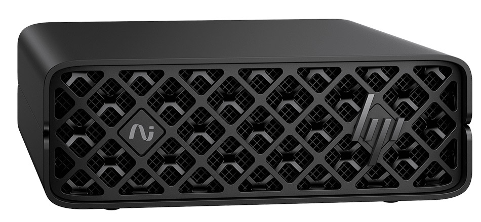

# 実行環境PC スペック調査

Claude Code が動作しているホストマシンのハードウェア構成と、ローカルAI用途での実力評価

> 📅 作成: 2026-08-24 / 更新: 2026-09-23

[^^](../../README.md)

> [!IMPORTANT]
> <strong>この資料は 2026-09-05 時点の情報です。</strong>価格・在庫・キャンペーンはその後変わっています。最新の比較は [ローカルLLM 機種比較 2026](r260916-01-ローカルLLM機種比較.md) を参照してください。

## 目次

1. [調査対象と調査方法](#1-調査対象と調査方法)
2. [システム構成の全体像](#2-システム構成の全体像)
3. [CPU: Core i7-11370H](#3-cpu-core-i7-11370h)
4. [GPU: RTX 3050 Ti Laptop / Iris Xe](#4-gpu-rtx-3050-ti-laptop--iris-xe)
5. [メモリ・ストレージ・周辺](#5-メモリストレージ周辺)
6. [AI用途で見たときの評価](#6-ai用途で見たときの評価)

## 1. 調査対象と調査方法

本レポートは、Claude Code のセッションが動作しているホストマシンそのものを調査したものです。カタログ値ではなく、実機から取得した値を記載しています。

### 調査手段

すべて PowerShell から実行しました。ベンチマークは実施しておらず、構成情報の取得のみです。

```powershell
Get-CimInstance Win32_ComputerSystem   # メーカー・モデル・搭載メモリ総量
Get-CimInstance Win32_Processor        # CPU
Get-CimInstance Win32_VideoController  # GPU
Get-CimInstance Win32_PhysicalMemory   # メモリモジュール個別
Get-CimInstance Win32_DiskDrive        # 物理ディスク
Get-Volume                             # ボリューム使用量
nvidia-smi                             # VRAM・compute capability
Get-NetAdapter                         # ネットワーク
```

### 記載方針

ホスト名・マシン名・ユーザー名・シリアル番号は本レポートに記載しません。製品モデル名までを記載対象としています。

> [!NOTE]
> **調査日時点の状態です。** ストレージ空き容量やバッテリー残量のように時間で変わる値は、2026-08-24 時点のスナップショットとして読んでください。

## 2. システム構成の全体像

| 項目 | 値 | 補足 |
|---|---|---|
| メーカー | HP | — |
| モデル | HP Pavilion Gaming Laptop 15-dk2xxx | 個人向けゲーミングノート。SKU `46L17PA#ABJ`（日本向け） |
| 製品ファミリ | 103C_5335KV HP Pavilion | — |
| マザーボード | HP 88E5 (rev 76.41) | ノート専用基板 |
| BIOS | Insyde F.21 | リリース 2022-10-24。以降更新されていない |
| OS | Windows 11 Home | Version 10.0.26200 / Build 26200 |
| アーキテクチャ | 64 ビット | x64-based PC |
| OSインストール日 | 2024-11-22 | — |
| 物理メモリ総量 | 16,913,522,688 バイト | 約 15.75 GiB（16 GB 構成） |
| 論理プロセッサ数 | 8 | 物理4コア + Hyper-Threading |

### 仮想化の状態

ここは値の読み方に注意が必要です。`Win32_Processor` の `VirtualizationFirmwareEnabled` は `False` を返しますが、これは仮想化支援が無効という意味ではありません。

| プロパティ | 値 | 解釈 |
|---|---|---|
| `VirtualizationFirmwareEnabled` | False | Hyper-V が既に起動している環境では、この値は `False` として報告される |
| `HypervisorPresent` | True | ✅ **稼働中** ハイパーバイザーが動作している |
| 仮想ネットワークアダプタ | vEthernet (WSL) | Hyper-V Virtual Ethernet Adapter が 10 Gbps でリンクアップ済み |

つまり **WSL2 が実際に動作しており、仮想化支援は有効に機能しています**。`VirtualizationFirmwareEnabled: False` だけを見て「BIOS で仮想化が無効」と判断すると誤ります。

## 3. CPU: Core i7-11370H

| 項目 | 値 |
|---|---|
| 製品名 | 11th Gen Intel Core i7-11370H @ 3.30GHz |
| 識別 | `Intel64 Family 6 Model 140 Stepping 1`（Tiger Lake-H35 世代） |
| 物理コア数 | 4 |
| 論理プロセッサ数 | 8 |
| 基準クロック | 3,302 MHz |
| L2 キャッシュ | 5,120 KB |
| L3 キャッシュ | 12,288 KB |
| ソケット | U3E1（BGA・交換不可） |

4コア8スレッドの薄型ノート向け H35 シリーズです。ビルドやテスト実行のような並列処理では、同世代でも6〜8コアのモデルと比べて頭打ちになりやすい構成です。

> [!IMPORTANT]
> **BGA実装のため CPU の交換はできません。** このマシンで性能を伸ばす余地はメモリとストレージに限られます。

## 4. GPU: RTX 3050 Ti Laptop / Iris Xe

GPU は2基搭載のハイブリッド構成です。省電力時は内蔵GPU、負荷時にディスクリートGPUへ切り替わります。

### NVIDIA GeForce RTX 3050 Ti Laptop GPU（ディスクリート）

| 項目 | 値 | 備考 |
|---|---|---|
| VRAM | 4,096 MiB | ⚠ **4 GB** ローカルLLMではここが最大の制約になる |
| Compute Capability | 8.6 | Ampere 世代。CUDA・Tensor Core 利用可 |
| ドライバ（nvidia-smi） | 592.82 | 取得日 2026-08-24 |
| ドライバ（WMI表記） | 32.0.15.9282 | 2026-06-03 |

### Intel Iris Xe Graphics（内蔵）

| 項目 | 値 |
|---|---|
| 共有メモリ | 約 2,048 MB |
| ドライバ | 32.0.101.7088（2026-06-17） |
| 表示解像度 | 1920 × 1080 |
| リフレッシュレート | 143 Hz |

内蔵ディスプレイは 1920×1080 の 144 Hz クラスのパネルで、実測 143 Hz で駆動しています。画面出力は Iris Xe 側が担当しており、RTX 3050 Ti には解像度・リフレッシュレートが報告されていません（典型的な Optimus 構成）。

## 5. メモリ・ストレージ・周辺

### メモリ

| スロット | 容量 | 速度 | 製造元 | 型番 |
|---|---:|---:|---|---|
| Bottom - Slot 1 (left) | 8 GB | 3,200 MT/s | SK Hynix | `HMA81GS6DJR8N-XN` |
| Bottom - Slot 2 (right) | 8 GB | 3,200 MT/s | SK Hynix | `HMA81GS6DJR8N-XN` |

DDR4-3200 の 8 GB モジュール2枚でデュアルチャネル動作しています。設定クロックも 3,200 MT/s で、定格通りです。

> [!IMPORTANT]
> **2スロットとも埋まっています。** 増設ではなく交換が必要で、32 GB にするには両方入れ替えることになります。デュアルチャネル DDR4-3200 の理論帯域は **約 51.2 GB/s**（3,200 MT/s × 8 バイト × 2ch）です。この数字は後の章で AI ワークステーションと比較します。

### ストレージ

| 項目 | 値 |
|---|---|
| モデル | KIOXIA KXG60ZNV1T02（NVMe） |
| 容量 | 1,024,203,640,320 バイト（約 1 TB） |
| パーティション数 | 3 |
| C: 総容量 | 952.6 GB |
| C: 空き容量 | 400.7 GB |
| ファイルシステム | NTFS |

KIOXIA KXG60 は PCIe 3.0 x4 世代の NVMe SSD です。空き 400 GB は確保されており、大きめのモデルファイルを置く余地はあります。

### ネットワークと電源

| 項目 | 値 | 状態 |
|---|---|---|
| Wi-Fi | Intel Wi-Fi 6 AX201 160MHz | リンク速度 866.7 Mbps ✅ **接続中** |
| 仮想アダプタ | Hyper-V Virtual Ethernet (WSL) | 10 Gbps ✅ **稼働中** |
| 有線LAN | — | **未接続** |
| バッテリー | 設計電圧 12,784 mV | 残量 100% |

調査時点ではネットワーク接続は Wi-Fi 6 のみで、有線 LAN は接続されていません。

## 6. AI用途で見たときの評価

このマシンで大規模言語モデルをローカル実行する場合、決定的な制約は **VRAM 4 GB** です。同じ 2026 年に選択肢となる AI 専用ワークステーション（本調査の別レポートで比較した HP ZGX Nano G1n）と並べると、差が一目で分かります。

### 環境PC と AI専用機の比較

| 項目 | この環境PC | HP ZGX Nano G1n（AI専用機） | 差 |
|---|---|---|---|
| 外観 |  |  | ノート型 / 手のひらサイズ据置型 |
| 形態 | 15インチ ノートPC | デスクトップ（150×150×51 mm） | — |
| CPU | Intel Core i7-11370H<br>4コア8スレッド | NVIDIA GB10 Grace Blackwell<br>Arm 20コア（X925×10 + A725×10） | コア数 **5倍** |
| AIに使えるメモリ | 4 GB（VRAM） | 128 GB（統合メモリ） | ❌ **32倍差** |
| メモリ帯域 | 約 51.2 GB/s<br>（DDR4-3200 2ch） | 273 GB/s<br>（LPDDR5x 256bit） | **約 5.3倍** |
| システムメモリ | 16 GB（交換で最大32GB） | 128 GB（オンボード・増設不可） | — |
| ストレージ | KIOXIA 1 TB NVMe（PCIe 3.0） | 4 TB NVMe SED（PCIe 4.0 x4） | 容量 4倍 |
| GPU世代 | Ampere（compute 8.6） | Blackwell | 2世代差 |
| OS | Windows 11 Home | NVIDIA DGX OS 7（Ubuntuベース） | — |
| 価格 | 約20万円 | 1,098,900 円<br>税込<br>定価 2,125,200 円 | — |
| ネットワーク | Wi-Fi 6 AX201（866.7 Mbps） | ConnectX-7 **200GbE** ＋ 10GbE ＋ Wi-Fi 7 | — |

比較対象の HP ZGX Nano G1n の価格・仕様は、日本HP のキャンペーンページと公式スペック表に基づきます。詳細は [ローカルLLM 機種比較 2026](r260916-01-ローカルLLM機種比較.md) を参照してください。

### 実際に何ができるか

#### できること

- 7B クラスのモデルを 4bit 量子化して動かす（VRAM 4 GB にぎりぎり収まる範囲）
- CPU + システムメモリへのオフロードを併用した推論（速度は大きく落ちる）
- WSL2 上での CUDA 開発・動作確認。compute capability 8.6 なので Ampere 向けカーネルはそのまま動く
- コード生成・編集の実務作業（本セッションのような用途）

#### 厳しいこと

- ❌ **不可** 70B クラス以上のモデルを GPU に載せる（4 GB では量子化しても入らない）
- ❌ **不可** 200B パラメータ級モデルのファインチューニング（GB10 機の売り文句にあたる領域）
- ⚠ **要注意** 長いコンテキストでの推論。KVキャッシュが VRAM を急速に食い潰す
- ⚠ **要注意** 学習用途全般。4 GB ではバッチサイズを極端に絞る必要がある

> [!IMPORTANT]
> **ボトルネックは VRAM の一点に集約されます。** CPU が 4 コアであることや DDR4 世代であることよりも、GPU メモリ 4 GB という上限が扱えるモデルサイズを直接決めています。AI 用途を本格化させる場合、このマシンのメモリ増設やストレージ交換では解決せず、統合メモリを大量に持つ別の機材が必要になります。

### 調査結果のまとめ

| 観点 | 評価 | 理由 |
|---|---|---|
| 開発機としての実用性 | ✅ **十分** | 4C8T・16 GB・空き 400 GB。コード作業と WSL2 利用に問題なし |
| 小規模ローカルLLM | ⚠ **限定的** | 7B 級 4bit 量子化が上限 |
| 中〜大規模モデル | ❌ **不可** | VRAM 4 GB が絶対的な壁 |
| アップグレード余地 | ⚠ **小** | CPU は BGA、メモリは全スロット占有済み。交換のみ |

[^^](../../README.md)
