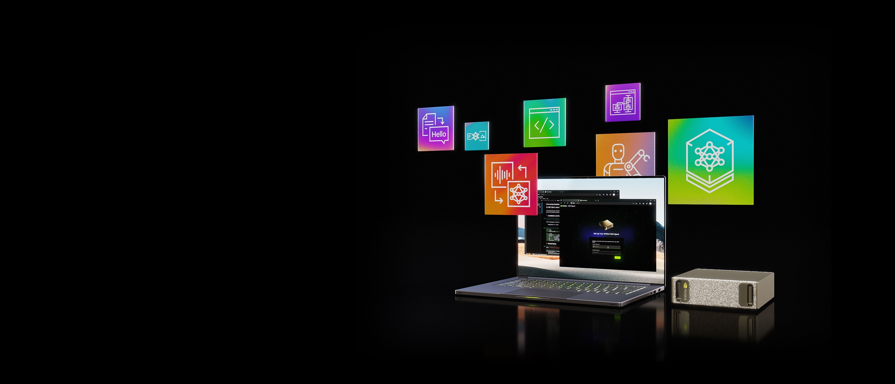
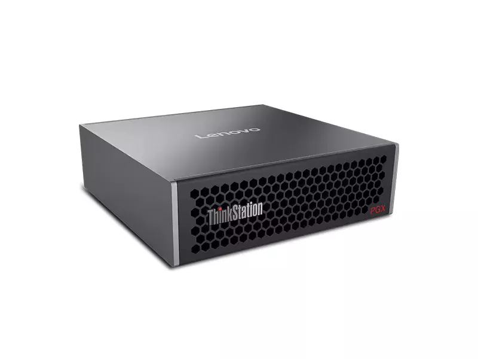
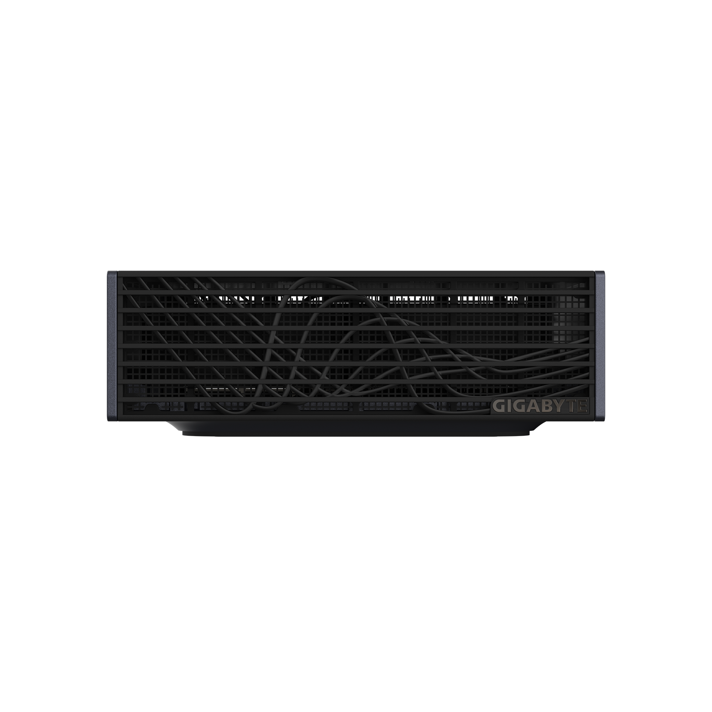
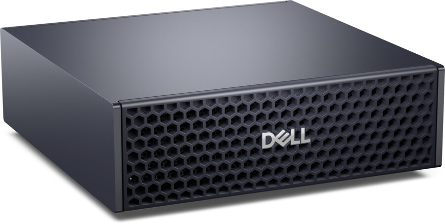
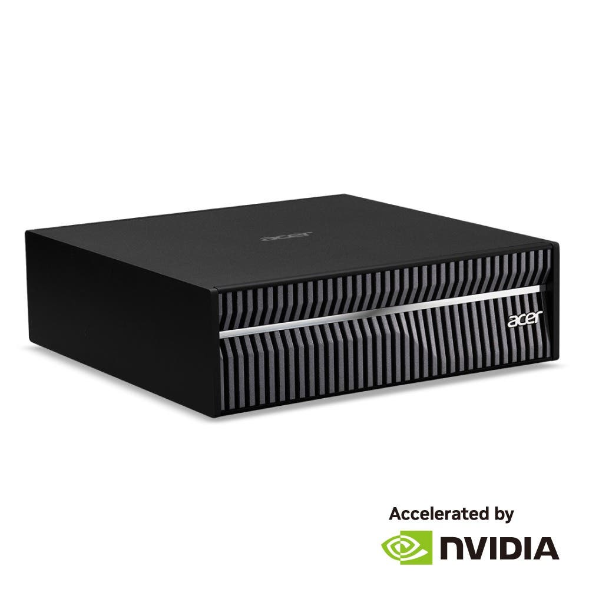
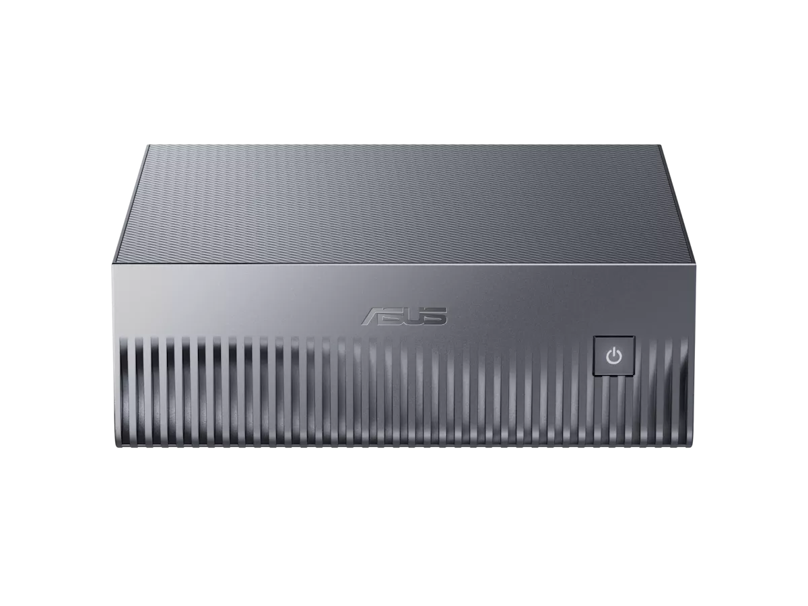
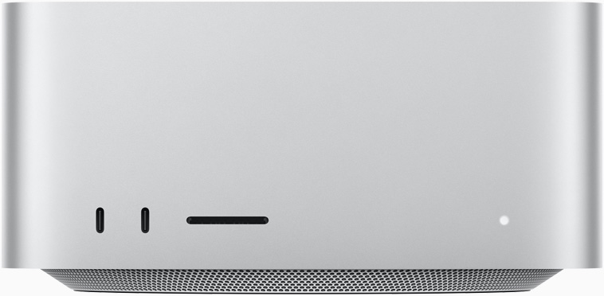
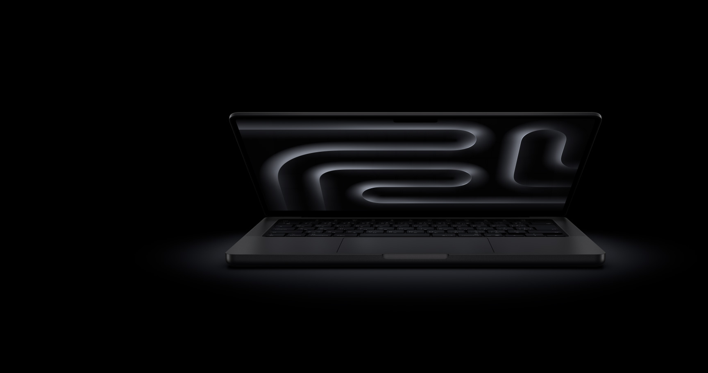

# GB10搭載AIワークステーション 価格比較調査

NVIDIA GB10 Grace Blackwell を積んだ8機種を同一構成（128GB / 4TB）に揃えて国内価格で比較し、Apple Mac の現行構成とも突き合わせる

> 📅 作成: 2026-08-24 / 更新: 2026-09-19

« [README に戻る](../../README.md)

> [!IMPORTANT]
> <strong>この資料は 2026-09-05 時点の情報です。</strong>価格・在庫・キャンペーンはその後変わっています。最新の比較は [ローカルLLM 機種比較 2026](r260916-01-ローカルLLM機種比較.md) を参照してください。

## 目次

1. [調査の経緯と情報源の扱い](#1-調査の経緯と情報源の扱い)
2. [基準機: HP ZGX Nano G1n](#2-基準機-hp-zgx-nano-g1n)
3. [4TB同一構成での全機種比較](#3-4tb同一構成での全機種比較)
4. [容量が異なる構成の扱い](#4-容量が異なる構成の扱い)
5. [二次情報との乖離と訂正](#5-二次情報との乖離と訂正)
6. [Apple Mac との比較](#6-apple-mac-との比較)
7. [選定の判断材料と結論](#7-選定の判断材料と結論)

## 1. 調査の経緯と情報源の扱い

調査の出発点は、日本HPが実施している **HP ZGX Nano G1n AI Station のキャンペーン**ページでした。そこから「同じスペックの機種は他にどれがあり、いくらなのか」を調べています。

### 調査手段は3回変えている

この調査は取得手段を途中で切り替えました。結果の信頼性に関わるため記録しておきます。

| 段階 | 手段 | 結果 |
|---|---|---|
| 1回目 | WebFetch | HPキャンペーンページと比較記事は読めた。しかし各社の価格は**個人ブログ1本に依拠**する状態で、精度が不足していた |
| 2回目 | claude-in-chrome | Lenovo・Dell・Acer・価格.com の一次情報を取得。ブログ値の誤りを複数発見。ただし `javascript_tool` が一部サイトで `[BLOCKED: Cookie/query string data]` となり、画像URLの収集は完遂できなかった |
| 3回目 | PlayWright（共有環境） | ヘッドレスChromium で lazy load を発火させ、**製品画像9件すべてを公式・正規流通ドメインから取得** |

### 価格の出典区分

本レポートでは価格の出典を3段階に分けて扱っています。読むときはこの区別を前提にしてください。

| 区分 | 意味 | 該当 |
|---|---|---|
| ✅ **公式直販** | メーカー自身が提示している価格 | HP・Dell・Lenovo・Acer |
| ⚠ **正規流通** | 国内正規代理店・販売店の掲載価格 | アーク（ASUS・Lenovo） |
| **通販横断** | 価格.com等の最安値。出品者・保証条件は個別確認が必要 | NVIDIA純正・GIGABYTE・MSI |

> [!NOTE]
> **PlayWright を使った画像収集では、出典を2回やり直しています。** 1回目は MSI が YouTube のサムネイル、環境PCが第三者ブログから取れてしまったため、許可ホストを `msi.com` / `hp.com` に限定して取り直しました。最終的に採用したのはすべてメーカー公式CDNか正規販売店の画像です。

## 2. 基準機: HP ZGX Nano G1n

この機種は **NVIDIA DGX Spark のリファレンス設計をそのまま採用した OEM 機**です。したがって比較対象は「似たスペックの他社機」ではなく、事実上「同じ設計の別ブランド機」になります。

| 項目 | 仕様 |
|---|---|
| SoC | NVIDIA GB10 Grace Blackwell Superchip |
| CPU | Arm 20コア（Cortex-X925 ×10 + Cortex-A725 ×10） |
| GPU | NVIDIA Blackwell（GB10 内蔵） |
| メモリ | 128 GB LPDDR5x 統合システムメモリ（256bit・帯域 273 GB/s）⚠ **オンボード・増設不可** |
| ストレージ | 4 TB PCIe 4.0 x4 NVMe SED（OPAL 自己暗号化） |
| AI性能 | 1 PFLOPS（FP4）／最大 1,000 TOPS |
| 対応モデル規模 | 最大 2,000 億パラメータ |
| ネットワーク | NVIDIA ConnectX-7 NIC ×1、10 Gigabit LAN（RJ45）×1、Wi-Fi 7、Bluetooth 5.4 |
| 電源 | 付属 AC アダプター 240 W |
| 本体サイズ | 150（W）× 150（L）× 51（H）mm |
| OS | NVIDIA DGX OS 7（Ubuntu ベース） |
| 保証 | 1年センドバック |
| 定価 | 2,125,200 円（税込） |
| キャンペーン価格 | **998,800 円（税込）**／500台限定・約53%オフ |

### 2台連結による拡張

ConnectX-7 を使って同型機2台を直結でき、扱えるモデル規模を拡張できます。これは GB10 系すべてに共通する機能で、機種選定の差にはなりません。

### スペック表で確定した仕様

キャンペーンページだけでは読み取れなかった部分が、日本HP のスペック表ページ（`jp.ext.hp.com/prod/workstations/zgx_nano_ai_station/bto/`）で確定しました。

| 項目 | スペック表の記載 | キャンペーンページ |
|---|---|---|
| ConnectX-7 | **200GbE** イーサネットコントローラー（ZGX Nano 相互接続用） | 帯域の記載なし |
| 電源アダプター | 240W **TypeC**（89% 変換効率） | 240W のみ |
| ストレージ | 4TB PCIe NVMe OPAL M.2 SSD | 4TB PCIe-4x4 2242 NVMe SED OPAL |
| メモリ | 128GB LPDDR5x（ユニファイド・オンボード）・帯域 **273GB/s** | 128GB LPDDR5x（オンボード） |
| 付属品 | **キーボードなし** **マウスなし** 「マウス、キーボードは同梱しません」と明記 | 記載なし |
| OS | NVIDIA DGX OS | 一致 |
| 保証 | 1年間センドバック保証 | 一致 |

> [!IMPORTANT]
> **ConnectX-7 は 200GbE です。** 2台連結時の帯域がこれで決まります。また電源が USB TypeC 給電（240W・89%効率）であることも、キャンペーンページではなくスペック表側にしか書かれていません。キーボード・マウスは付属しないため、別途用意が必要です。

## 3. 4TB同一構成での全機種比較

ストレージ容量を **4 TB に揃えた8機種**です。CPU・メモリ・帯域・AI性能・本体サイズはすべて同一なので、実質的に価格と保証だけの比較になります。安い順に並べています。

HP は **キャンペーン価格の税込 998,800 円**を採用しました。差額列はこの金額を基準にしています。

| 製品 | 外観 | 価格（税込） | HPとの差額 | 保証・流通形態 | 出典 |
|---|---|---:|---:|---|---|
| **HP ZGX Nano G1n** |  | **998,800 円** キャンペーン価格 定価 2,125,200 円 | 基準 | 1年センドバック | ✅ **公式直販** |
| **NVIDIA DGX Spark** 純正基準機 |  | 1,078,000 円〜 | +79,200 円 | 販売店依存 | **通販横断** |
| **Lenovo ThinkStation PGX** 4TB / 1年保証 |  | 1,092,300 円 | +93,500 円 | 1年（正規代理店保証） | ⚠ **正規流通** |
| **MSI EdgeXpert MS-C931** |  | 1,110,659 円 | +111,859 円 | ⚠ **要注意** Amazon 第三者出品者経由。国内代理店保証の有無は不明 | **通販横断** |
| **GIGABYTE AI TOP ATOM** ATAGB10-9001 |  | 1,230,000 円〜 | +231,200 円 | 販売店依存 | **通販横断** |
| **Dell Pro Max with GB10** |  | 1,278,847 円 | +280,047 円 | ✅ **オンサイト保守を選択可** | ✅ **公式直販** |
| **Lenovo ThinkStation PGX** 4TB / 3年・型番 30KLS0GB00 |  | 1,399,970 円 | +401,170 円 | ✅ **3年プレミアサポート** | ✅ **公式直販** |
| **Acer Veriton GN100** |  | 1,799,820 円 通常 1,999,800 円 | +801,020 円 | Acer公式直販・在庫あり・送料無料 | ✅ **公式直販** |

> [!IMPORTANT]
> **すべて Web 掲載価格での比較です。** 差額列は「現時点の提示価格の差」であり、交渉後の最終差額ではありません。法人向けの構成では個別見積で下がる余地があるため、実際の調達額はこの表より低くなり得ます。

### 全機種で共通している仕様

一次情報で突き合わせた結果、以下はすべての機種で一致していました。**性能で選ぶ意味はありません。**

| 項目 | 全機種共通の値 |
|---|---|
| SoC | NVIDIA GB10 Grace Blackwell Superchip |
| CPU構成 | Arm 20コア（Cortex-X925 ×10 + Cortex-A725 ×10） |
| メモリ | 128 GB LPDDR5x 統合メモリ・256bit・**273 GB/s** |
| AI性能 | 1 PFLOPS（FP4）／1,000 TOPS |
| ネットワーク | ConnectX-7 NIC、10GbE RJ45、Wi-Fi 7、Bluetooth 5.4 |
| 電源 | 240 W AC アダプター |
| 本体サイズ | 150 × 150 × 約 51 mm（Lenovo のみ高さ 50.5 mm 表記） |
| OS | NVIDIA DGX OS（Ubuntu ベース） |

> [!IMPORTANT]
> **価格差 80万円は保証と流通経路の差です。** 最安の HP（998,800円）と最高値の Acer（1,799,820円）の間で、動作性能は変わりません。差額が何に対する対価なのかを見て選ぶことになります。

## 4. 容量が異なる構成の扱い

以下は 4 TB ではないため、前章の表とは直接比較できません。**安く見えても容量が違います。**

| 製品 | 外観 | 容量 | 価格（税込） | 状態・備考 |
|---|---|---|---:|---|
| **ASUS Ascent GX10** GX10-GG0006BN |  | 1 TB | 899,800 円 通常 1,186,900 円 | ❌ **在庫なし** アーク掲載・セール価格。次回入荷未定 |
| **ASUS Ascent GX10** |  | 1 TB | 826,013 円 | 価格.com 通販最安。⚠ **要注意** 並行輸入・海外業者を含む可能性あり |
| **Lenovo ThinkStation PGX** 30KLS0G900 |  | 2 TB | 1,199,990 円 | Lenovo公式直販・3年プレミアサポート・送料無料 |

> [!IMPORTANT]
> **ASUS の 826,013 円は表面上の最安値ですが、選定候補にはなりにくいです。** 1 TB 構成なので HP の 4 TB とは比較になりません。加えてアークの正規流通分は在庫切れで、価格.com の最安値は出品者が特定できません。

## 5. 二次情報との乖離と訂正

調査初期に参照した個人ブログの価格表を、一次情報で1件ずつ検証しました。**8件中3件が誤りでした。**

| 製品 | 二次情報（ブログ） | 一次情報で確認した実際の値 | 判定 |
|---|---|---|---|
| ASUS Ascent GX10 | 1,248,000 円 | 899,800 円（1TB・在庫なし）／826,013 円（通販最安） | ❌ **誤り** |
| Lenovo ThinkStation PGX | 1TB で 1,199,900 円 | **2TB / 3年プレミアサポート**で 1,199,990 円。1TB構成ではなかった | ❌ **誤り** |
| MSI EdgeXpert | 4TB で 998,000 円 | 1,110,659 円。998,000 円の裏付けは取れなかった | ❌ **誤り** |
| Acer Veriton GN100 | 1,799,820 円 | 一致。Acer公式直販の特別価格（通常 1,999,800 円） | ✅ **正しい** |
| GIGABYTE AI TOP ATOM | 4TB で 1,230,000 円 | 一致。型番 ATAGB10-9001 | ✅ **正しい** |
| Dell Pro Max with GB10 | 1,278,847 円 | 一致。Dell公式で確認 | ✅ **正しい** |
| NVIDIA DGX Spark | 1,078,000 円 | 一致 | ✅ **正しい** |
| HP ZGX Nano G1n | 998,800 円 | 一致。日本HP のキャンペーンページで確認（定価 2,125,200 円からの台数限定価格） | ✅ **正しい** |

### この検証で結論が変わった点

初期の結論では「4 TB で100万円を切るのは HP と MSI の2機種」としていました。MSI の実売が 1,110,659 円だったため、**100万円を切るのは HP のみ**に訂正されます。HP は単独最安になり、2位との差も約8万円に広がりました。

### 二次情報に頼るとどこを外すか

誤っていた3件は、いずれも**構成が違うのに同じ製品名で並べていた**ことに起因します。ASUS と Lenovo は容量が異なり、MSI は裏付けの取れない価格でした。製品名だけを見て価格を比べると、容量差がそのまま価格差に見えてしまいます。

> [!IMPORTANT]
> **比較の前提は「同一構成に揃うこと」です。** 本レポートで 4TB 構成に限定したのはこのためで、容量の異なる機種は別章に分けています。価格だけを並べた表は、構成の列が無い時点で比較として成立しません。

## 6. Apple Mac との比較

GB10 搭載機と同じ「大容量ユニファイドメモリでローカルAIを動かす」用途で、Apple Mac も候補になります。2026-08-25 時点で **Apple 公式ストア（日本）で実際に構成を選択して取得した価格**です。カタログ値ではなく、その構成でカートに進める金額を記載しています。

### メモリ容量はCPU/GPU構成に固定されている

調査して分かった最も重要な仕様上の制約です。Mac はメモリを自由に選べるわけではなく、**チップのコア構成ごとに容量が1対1で決まります**。

| 機種 | チップ / コア構成 | 選べるメモリ | メモリ帯域 |
|---|---|---|---|
| Mac Studio | M4 Max 14コアCPU / 32コアGPU | 36GB のみ | 410 GB/s |
| Mac Studio | M4 Max 16コアCPU / 40コアGPU | 64GB のみ | 546 GB/s |
| Mac Studio | M3 Ultra 28コアCPU / 60コアGPU | 96GB のみ | 819 GB/s |
| Mac Studio | M3 Ultra 32コアCPU / 80コアGPU | 96GB のみ | 819 GB/s |
| MacBook Pro 16" | M5 Max 18コアCPU / 40コアGPU | 48 / 64 / **128GB** | 614 GB/s |
| Mac mini | M4 | 16 / 24GB | — |
| Mac mini | M4 Pro | 24 / 48GB | — |

> [!IMPORTANT]
> **据置型の Mac Studio は 96GB が上限で、128GB に届きません。** Apple で 128GB を積めるのは MacBook Pro の M5 Max だけです。なお Mac Studio は M4 Max / M3 Ultra 世代のままで、MacBook Pro だけが M5 世代に更新されており、同時点でも搭載チップの世代がずれています。

### Mac Studio の構成別価格

| 構成 | メモリ | 帯域 | ストレージ | 価格（税込） |
|---|---:|---:|---|---:|
| M4 Max 14C/32C | 36GB | 410 GB/s | 512GB | 419,800 円 |
| M4 Max 16C/40C | 64GB | 546 GB/s | 1TB | 653,800 円 |
| M4 Max 16C/40C | 64GB | 546 GB/s | 4TB | 923,800 円 |
| M4 Max 16C/40C | 64GB | 546 GB/s | 8TB | 1,283,800 円 |
| M3 Ultra 28C/60C | 96GB | 819 GB/s | 1TB | 899,800 円 |
| M3 Ultra 28C/60C | 96GB | 819 GB/s | 4TB | 1,169,800 円 |
| M3 Ultra 32C/80C | 96GB | 819 GB/s | 4TB | 1,439,800 円 |

### MacBook Pro 16インチの構成別価格

スペースブラック・標準ディスプレイで構成した場合です。M5 Max ではストレージの下限が 2TB になります。

| 構成 | メモリ | 帯域 | ストレージ | 価格（税込） |
|---|---:|---:|---|---:|
| M5 Max 18C/40C | 48GB | 614 GB/s | 2TB | 849,800 円 |
| M5 Max 18C/40C | 128GB | 614 GB/s | 2TB | 1,209,800 円 |
| M5 Max 18C/40C | 128GB | 614 GB/s | 4TB | 1,389,800 円 |

### HP ZGX Nano G1n との直接比較

メモリ容量を揃えると、こうなります。HP はキャンペーン価格、Apple は公式ストアの構成価格です。

| 比較条件 | HP ZGX Nano G1n | Apple 側の該当機 | 価格差 | 帯域差 |
|---|---:|---|---:|---:|
| **128GB / 4TB** （同容量） | 998,800 円 273 GB/s | MacBook Pro 16" M5 Max1,389,800 円 / 614 GB/s | Mac が +391,000 円 | Mac が **2.25倍** |
| **4TB で最速** | 998,800 円 128GB / 273 GB/s | Mac Studio M3 Ultra 96GB1,169,800 円 / 819 GB/s | Mac が +171,000 円 | Mac が **3.0倍** |
| **4TB で下位価格帯** | 998,800 円 128GB / 273 GB/s | Mac Studio M4 Max 64GB923,800 円 / 546 GB/s | Mac が −75,000 円 | Mac が **2.0倍** |

### 容量を取るか、帯域を取るか

この比較は、単純な優劣ではなく**トレードオフの構造**になっています。

| 観点 | GB10 搭載機が有利 | Apple Mac が有利 |
|---|---|---|
| メモリ容量 | ✅ **128GB** 同価格帯で最大容量。据置型で128GBを積めるのは GB10 側だけ | Mac Studio は 96GB 止まり。128GB はノート型の MacBook Pro のみ |
| メモリ帯域 | 273 GB/s。今回比較した Mac の全構成より遅い | ✅ **546〜819 GB/s** 2.0〜3.0倍。トークン生成速度に直結する |
| エコシステム | ✅ **CUDA** NVIDIA DGX OS 7（Ubuntuベース）。既存のCUDA資産がそのまま動く | macOS + Metal / MLX。CUDA前提のコードは移植が必要 |
| 拡張 | ✅ **2台連結** ConnectX-7 200GbE で同型機を直結し、扱えるモデル規模を拡張できる | 同等の直結手段はない |
| 消費電力 | ✅ **240W** TypeC アダプター（89%変換効率） | Mac Studio は最大 480W（連続使用時） |
| 設置サイズ | ✅ **150×150×51 mm** | Mac Studio は 197×197×95 mm（体積で約4.6倍） |
| 汎用性 | DGX OS 専用機。日常用途には向かない | ✅ **汎用PC** 開発・制作・日常利用を1台で兼ねられる |
| 可搬性 | 据置（ただし手のひらサイズで持ち運びは可能） | ✅ **MacBook Pro** は128GBをノートで持ち運べる |

> [!IMPORTANT]
> **LLM の推論速度はメモリ帯域に強く律速されます。** モデルが 96GB に収まるなら、帯域が3倍ある Mac Studio M3 Ultra のほうがトークン生成は速くなる可能性が高く、逆に 96GB を超えるモデルを扱うなら Mac Studio は選択肢から外れます。容量と帯域のどちらが先に効くかは、動かすモデルのサイズで決まります。

### 実測レポートによる裏付け

ここまでは帯域の数値から速度を推定してきましたが、**M4 Max・128GB の MacBook Pro で 200B 級の MoE モデルを動かした実測**が公開されています（J-Tech Japan・2026-08-28）。同じ 128GB クラスの実例なので、本レポートの推定と突き合わせられます。

| 項目 | 実測値 |
|---|---|
| 検証機 | MacBook Pro M4 Max / 128GB ユニファイドメモリ（帯域 546 GB/s） |
| モデル | Qwen3.8 Flash Next（MoE・総 200B / アクティブ約 10B） |
| 量子化とサイズ | UD-Q3_K_XL（3bit）・約 90 GB |
| 実行環境 | llama.cpp `llama-server`（`-ngl 999 -c 65536`）＋ OpenCode |
| **実効スループット** | **9〜10 tok/s**（セッション平均） |
| メモリ使用量 | 約 88 GiB（重み＋KVキャッシュ） |
| KVキャッシュ | 1トークン約 35 KiB（64k コンテキストで 2.3 GiB） |
| ツール呼び出し | 190 回・エラー 0 回 |
| 他との比較 | Dense 27B より 8 倍速い（1時間 vs 8時間）／ クラウドより 2.8 倍遅い（39分 vs 14分） |

#### GB10 搭載機での速度推定

デコード速度は帯域に律速されるため、同じモデル・同じ量子化なら帯域比でおおよその見当が付きます。

| 機種 | メモリ帯域 | 90GB モデルでの速度 |
|---|---:|---:|
| MacBook Pro M4 Max 128GB | 546 GB/s | **9〜10 tok/s**（実測） |
| HP ZGX Nano G1n（GB10） | 273 GB/s | 約 4.5〜5 tok/s（推定） |

> [!IMPORTANT]
> **容量の分岐点は 96GB と 128GB の間にあります。** 90GB のモデルに KV キャッシュ 2.3 GiB を足すと、96GB 機ではほとんど余裕が残りません。記事も BF16（354GB）は載らないため 3bit 量子化を選んだと述べています。なお GB10 の速度は帯域比からの推定で、実測ではありません。

## 7. 選定の判断材料と結論

### 用途別の推奨

| 優先したいこと | 選ぶべき機種 | 価格（税込） | 理由 |
|---|---|---:|---|
| 価格最優先 | **HP ZGX Nano G1n** | 998,800 円 キャンペーン価格 | 4TB同一構成で単独最安。2位の純正 DGX Spark に対し約8万円、Acer に対し80万円安い。ただし ⚠ **500台限定** ・1年センドバック |
| 保守体制優先 | **Dell Pro Max with GB10** | 1,278,847 円 | オンサイト保守を選択できる。HP との差額28万円が実質的な保守料 |
| 長期保証優先 | **Lenovo ThinkStation PGX** 4TB / 3年 | 1,399,970 円 | 3年プレミアサポート込み。HP との差額40万円で3年分の保守を前払いする形 |
| 純正構成にこだわる | **NVIDIA DGX Spark** | 1,078,000 円〜 | リファレンスそのもの。ソフトウェア情報が最も見つけやすい |
| 推論速度優先 （96GBに収まる範囲） | **Mac Studio M3 Ultra** 96GB / 4TB | 1,169,800 円 | メモリ帯域 819 GB/s は GB10 の 3.0倍。汎用PCとしても使える。ただし 96GB を超えるモデルは扱えず、CUDA 資産は移植が必要 |
| 128GBを持ち運ぶ | **MacBook Pro 16" M5 Max** 128GB / 4TB | 1,389,800 円 | 128GB をノート型で扱える唯一の選択肢。帯域 614 GB/s。HP との差額 39万円が可搬性と帯域の対価 |

### 避けたほうがよい選択

| 選択 | 問題 |
|---|---|
| MSI EdgeXpert（1,110,659円） | Amazon 第三者出品者経由で国内代理店保証が不透明。HP より18万円高く、保証面でも劣るため選ぶ理由が乏しい |
| Acer Veriton GN100（1,799,820円） | 同一スペックで HP の約1.9倍。「特別価格」表記だが他社比較では最も不利 |
| ASUS の安値だけを見る | 1 TB 構成であり 4 TB 機と比較にならない。正規流通分は在庫切れ |

### 総括

GB10 搭載機は NVIDIA のリファレンス設計であるため、**機種選定は性能比較ではなく調達条件の比較**になります。キャンペーン価格の税込 998,800 円により、HP は4TB構成で単独最安となり、2位との差は約8万円です。価格面では有利ですが、キャンペーンが前提の順位である点は差し引いて読む必要があります。

ただし判断の分かれ目は保証です。HP は1年センドバックのため、修理期間中は機材が手元から離れます。業務停止を避けたい場合、Dell のオンサイト保守（+28万円）や Lenovo の3年プレミアサポート（+40万円）は妥当な追加投資といえます。

付属品の面では、スペック表に **キーボード・マウスが同梱されない**と明記されています。モニターも別途必要なため、初期導入時はこれらの費用を見込む必要があります。

Apple Mac を含めると、選定軸が「価格」から「容量か帯域か」に変わります。**128GB が要件なら**、据置型では GB10 搭載機しかなく（Mac Studio は 96GB 上限）、価格でも HP が 39万円安いため GB10 が有利です。**96GB で足りるなら**、帯域が3倍ある Mac Studio M3 Ultra が推論速度で上回る可能性が高く、17万円の差額に見合うかはモデルサイズ次第です。CUDA 資産がある場合は移植コストも加算して判断することになります。

### 期限に関する注意

| 制約 | 内容 | 失効後どうなるか |
|---|---|---|
| キャンペーン台数 | **500台限定**。予定数に達し次第終了で、終了時はキャンペーンページ上に明記される | 定価 2,125,200 円に戻る。最安は純正 DGX Spark（1,078,000円〜）か Lenovo 4TB（1,092,300円）へ移る |
| キャンペーン期間 | キャンペーンページに期間が明示されている（延長された経緯あり） | 台数が残っていても期間満了で終了する |
| 在庫・調達変動 | 「製品の価格、仕様等は、予告なく変更される場合があります」とスペック表に記載 | 期間内でも金額が変わる場合がある |

> [!WARNING]
> **この順位はキャンペーンが続いていることが前提です。** 台数上限に達すると定価に戻り、GB10 搭載機の中で HP は最安ではなくなります。比較表を読み直すときは、まずキャンペーンページで受付が続いているかを確認してください。

### 参照した一次情報

- HP 公式キャンペーンページ（jp.ext.hp.com）— ZGX Nano G1n の価格・台数・期間
- HP 公式スペック表（jp.ext.hp.com/prod/workstations/zgx_nano_ai_station/bto/）— ConnectX-7 の帯域、電源方式、同梱品の有無
- Dell 公式（dell.com/ja-jp）— Pro Max with GB10 の構成と価格
- Lenovo 公式直販（lenovo.com/jp）— ThinkStation PGX の型番別価格・保証
- Acer 公式オンラインストア（store.acer.com）— Veriton GN100 の価格・在庫
- パソコンSHOPアーク（ark-pc.co.jp）— ASUS・Lenovo の正規流通価格と詳細スペック
- 価格.com — NVIDIA 純正・GIGABYTE・MSI の通販最安値
- NVIDIA 公式（nvidia.com）— DGX Spark 製品情報
- MSI 公式（storage-asset.msi.com）— EdgeXpert MS-C931 製品画像
- **Apple 公式ストア（apple.com/jp）**— Mac Studio・MacBook Pro・Mac mini の構成を実際に選択して取得した価格。仕様ページからメモリ帯域と構成上限

« [README に戻る](../../README.md)
